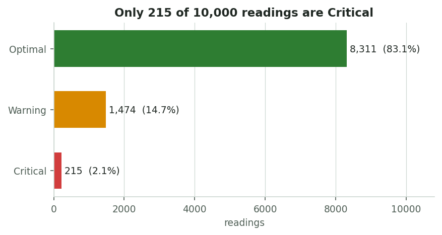
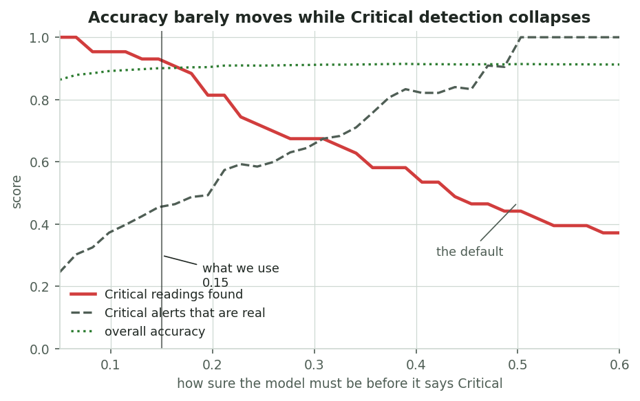
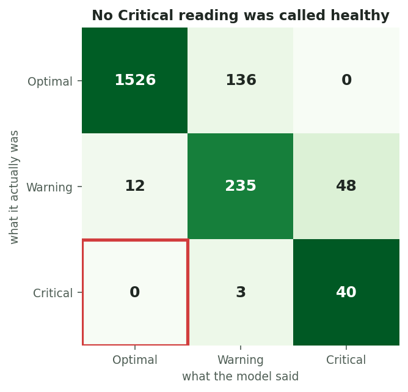
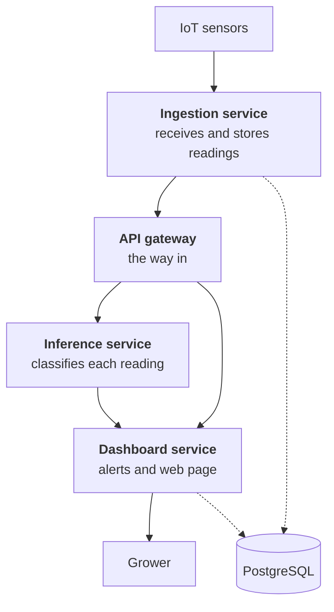

# Smart Indoor Farm Monitoring System

Sensors in each grow zone report every ten minutes. A machine learning model
decides whether the zone is **Optimal**, **Warning** or **Critical**, and the
dashboard raises an alert naming the zone and the likely equipment fault before
the crop is damaged.

**EGT307 AI Applications Development, 2026S1** · Nanyang Polytechnic, School of Engineering

---

## 1. The problem

Indoor farms grow crops in a fully controlled environment. Nothing protects the
crop if the equipment fails: if an irrigation pump dies overnight or the air
conditioning drifts, a whole crop cycle can be lost before the morning shift
arrives. Smaller farms still rely on staff walking round and checking manually,
which does not scale and does not happen at 3 am.

**Objectives**

| # | Objective | Where it is built |
|---|---|---|
| 1 | Collect readings from every zone every ten minutes | `simulator/`, `services/ingestion/` |
| 2 | Classify each zone, including the rare serious cases | `services/inference/` |
| 3 | Alert staff with the zone and the likely cause | `services/dashboard/` |
| 4 | Build it as separate services that can scale | four services, Kubernetes in `k8s/` |

**Who benefits.** Farm owners keep crop cycles that would otherwise be lost.
Staff stop doing routine checks and get sent to the exact zone. Managers see
every zone in one place and can spot equipment that keeps failing.

---

## 2. The dataset

`data/greenhouse_conditions.csv`, 10,000 readings, committed to this repository
so the project builds without downloading anything.

**Dataset provenance:** this is a custom synthetic dataset used for this
project. No matching public source was identified, and it must not be presented
as measurements collected from a real farm.

### What the model uses

Eleven inputs. Eight come from sensors; three come from a soil test and are
stored per zone in the database.

| Input | Where it comes from |
|---|---|
| temperature, soil humidity, soil moisture, air humidity | sensor |
| pH, soil EC, pressure, rainfall (water delivered) | sensor |
| nitrogen, phosphorus, potassium | `zones` table, from a soil test |

Those three nutrient values are about a third of the model's decision, which is
why the ingestion service looks them up and attaches them to every reading.

Light is **not** a model input, because the dataset has no light column. It is
checked by a separate rule instead (section 4).

### The problem the data creates

| Condition | Readings | Share |
|---|---|---|
| Optimal | 8,311 | 83% |
| Warning | 1,474 | 15% |
| Critical | 215 | **2%** |



Only 215 readings are Critical, and those are the only ones that matter. **A
normal model on this data is 96% accurate and finds only 44% of them.** It gets
that accuracy by almost never predicting the rare class.

### What we changed

Two things, both in `services/inference/train.py`:

1. **Class weights** — a mistake on a Critical reading is penalised 30 times more
   heavily during training than a mistake on a healthy one.
2. **A lower threshold** — instead of taking whichever class is most likely, we
   call a reading Critical as soon as the model gives it a 15% chance.

| | Critical readings found | Alerts that are real |
|---|---|---|
| Normal model | 47% | 91% |
| **Ours** | **93%** | 46% |



Accuracy barely moves across that whole range while Critical detection collapses.
That is the argument for not reporting accuracy.

The cost is that about half our Critical alerts are wrong. **That is only safe
because the dashboard waits for two bad readings in a row before alerting
anyone.** A false alarm is a one-off; a real fault is still there ten minutes
later. The sensitive model and the waiting rule were designed together, and
either one on its own would be a bad idea.



No Critical reading was mistaken for a healthy one. That is the failure that
would lose a crop, and it does not happen in our testing.

### Limitations

- The data is synthetic. It has not been checked against a real greenhouse.
- There are no timestamps in it, so trends could not be tested against the data.
- There is no light column, so lighting is handled by a rule rather than learned.

---

## 3. How the system is built

Four services, plus a database and the sensor simulator.

All five Python applications use **Flask** and start with a normal Python
command. Service-to-service HTTP calls use `requests`, while ingestion and
dashboard use the synchronous `psycopg2` PostgreSQL driver. This keeps the
backend consistent with the synchronous Flask examples taught in Week 16.



| Service | Port | What it does |
|---|---|---|
| `gateway` | 8080 | The single way in. Sends each request to the right service. |
| `ingestion` | internal | Stores readings, gets them classified, passes results on. |
| `inference` | internal | Decides Optimal, Warning or Critical. Stores nothing. |
| `dashboard` | 3000 | The web page, and the rule that decides when to alert. |
| `postgres` | internal | Zones, readings, predictions, alerts. |
| `simulator` | 8090 | Pretends to be the sensors. Not part of the product. |

### Modularity

Each service does one job and has its own Dockerfile. The inference service has
no database connection at all. The ingestion service only ever talks to the
gateway and does not know the inference service exists, so adding another
consumer later means adding one line to the gateway's route list.

### Week 16 Docker alignment

The implementation follows the same sequence as the supplied Docker practicals:

| Practical concept | This project |
|---|---|
| Flask application | Every Python web service creates `Flask(__name__)` |
| Image definition | Each service has its own `Dockerfile` |
| Dockerfile instructions | `FROM`, `WORKDIR`, `COPY`, `RUN`, `EXPOSE`, `CMD` |
| Start the application | `CMD ["python", ...]` |
| Install packages | `pip install --no-cache-dir -r requirements.txt` |
| Multi-container application | `docker-compose.yml` defines all six containers |
| Container communication | Compose service names such as `postgres` and `inference` act as hostnames |
| Persistent data | The named volume `pgdata` stores PostgreSQL data |
| Host/container ports | Dashboard `3000:8000`, gateway `8080:8000`, simulator `8090:8000` |

The ports and number of services are larger than the classroom examples, but
the Dockerfile, networking, volume and Compose techniques are the same.

### Scalability

The inference service is the one we scale, to three copies. It stores nothing
between requests, so any copy can answer any request. It is also the busiest:
every reading from every zone passes through it.

We deliberately do not scale the others. Ingestion and dashboard each hold a
database connection, so extra copies would multiply connections to a single
database. PostgreSQL cannot be copied at all without corrupting it.

### Fault tolerance

| If this happens | What the system does |
|---|---|
| The inference service is down | The reading is still saved, marked `pending`, and classified later. Losing a reading is permanent; losing a prediction is not. |
| A sensor sends the same reading twice | The database rejects the duplicate, so trends stay correct. |
| A sensor sends nothing | The reading is stored with a gap. The model fills it in. Throwing away the whole reading would lose the ten sensors that worked. |
| A sensor sends nonsense | Values outside what is physically possible are rejected immediately. |
| A service is slow | The gateway gives up after 15 seconds instead of leaving the caller waiting. |
| One bad reading | Nothing. Two in a row are needed before anyone is alerted. |

---

## 4. Two decisions worth explaining

**The alerting rule.** Covered above: the model is deliberately over-sensitive
and the two-reading rule is what makes that safe.

**The light check.** The dataset has no light column, so lighting cannot be part
of the model. Instead there is a rule: the grow lights should be on between 06:00
and 22:00 local time, so darkness at midday is a fault and darkness at 2 am is
normal. An early version had no idea what time it was and reported every zone as
failing all night. That bug is why the ingestion service converts UTC to
Singapore time before the check runs.

---

## 5. Running it

You need Docker Desktop.

```powershell
docker compose up --build -d
```

The first build takes a few minutes because the model is trained during it.

| What | Where |
|---|---|
| Dashboard | http://localhost:3000 |
| Are all services up? | http://localhost:8080/health/all |
| Model details | http://localhost:8080/api/model |

### Break a zone on purpose

```powershell
curl.exe -X POST http://localhost:8090/fault/Zone_01/pump
```

Soil moisture in Zone_01 starts dropping. After two bad readings the dashboard
shows an alert saying the irrigation pump may have stopped. Fix it with:

```powershell
curl.exe -X DELETE http://localhost:8090/fault/Zone_01
```

Other faults: `aircon`, `ventilation`, `lighting`.

On Windows use `curl.exe`, not `curl`. Plain `curl` in PowerShell is a different
command that takes different arguments.

### Check that it works

```powershell
powershell -ExecutionPolicy Bypass -File scripts\check-system.ps1
powershell -ExecutionPolicy Bypass -File scripts\check-containers.ps1
python -m pytest tests -q
```

The first sends readings through the whole system and checks the answers. The
second checks PostgreSQL and every Flask container in the running Compose
application. The third tests the Flask conversion, light rule, model and
alerting rule without needing Docker.

---

## 6. Building the images

```powershell
docker build -f services/gateway/Dockerfile   -t farm-gateway:1.0 .
docker build -f services/ingestion/Dockerfile -t farm-ingestion:1.0 .
docker build -f services/inference/Dockerfile -t farm-inference:1.0 .
docker build -f services/dashboard/Dockerfile -t farm-dashboard:1.0 .
docker build -f simulator/Dockerfile          -t farm-simulator:1.0 .
```

To publish them:

```powershell
docker login
docker tag farm-gateway:1.0 YOURNAME/farm-gateway:1.0
docker push YOURNAME/farm-gateway:1.0
```

Every build runs from the project root so the Dockerfiles can reach shared files.
The inference Dockerfile also runs `python train.py` during the build, so the
model is always included without a separate manual step. Like the Flask example
in the Week 16 notes, every image uses one straightforward build stage, exposes
its application port and starts with a Python `CMD`.

---

## 7. Deploying to Kubernetes

```powershell
minikube start --cpus 4 --memory 6144
minikube addons enable metrics-server

# build the images inside Minikube so they do not need to be downloaded
minikube -p minikube docker-env --shell powershell | Invoke-Expression
docker build -f services/inference/Dockerfile -t farm-inference:1.0 .
# ...and the same for the other four

kubectl apply -f k8s/
kubectl -n smart-farm get pods
```

Then open the dashboard and gateway:

```powershell
kubectl -n smart-farm port-forward svc/gateway 8080:8000     # leave running
kubectl -n smart-farm port-forward svc/dashboard 3000:8000   # leave running
```

### Scaling

```powershell
kubectl -n smart-farm scale deployment/inference --replicas=5
kubectl -n smart-farm get pods -l app=inference
kubectl -n smart-farm get hpa
```

Nothing else needs changing when you do that. The gateway sends requests to
`http://inference:8000` and Kubernetes spreads them across whatever copies exist.

There is also an autoscaler that adds copies (up to six) when CPU goes above 60%.

### Two things that go wrong

**`ImagePullBackOff`** means Kubernetes cannot find your images. Build them
inside Minikube using the `docker-env` line above.

**Everything running but the dashboard is empty** means the dashboard is looking
for the gateway at the wrong address:

```powershell
kubectl -n smart-farm set env deployment/dashboard GATEWAY_PUBLIC_URL=http://localhost:8080
```

---

## 8. Known limitations

- The dataset is synthetic and has no timestamps.
- About half our Critical alerts are false. This is a deliberate trade for
  finding 93% of the real ones, and the two-reading rule absorbs the rest.
- The system names the sensor that is furthest from normal, but cannot tell a
  dead pump from a blocked dripline. Both look the same from a sensor.
- Alerting lives inside the dashboard rather than being its own service. Simpler,
  but it means alerting cannot be scaled separately.
- There is no login. Fine in a lab, not on a real farm.
- One database, with no backup or standby.

---

## 9. Project structure

```
data/                   the dataset
db/init.sql             database tables
docs/charts/            charts used in the report
k8s/                    Kubernetes files, one per service
scripts/                checks and chart generation
services/
  gateway/              the way in
  ingestion/            receives and stores readings
  inference/            the model, and train.py
  dashboard/            web page and alerting
simulator/              pretends to be the sensors
tests/                  tests for the light rule and alert rule
docker-compose.yml      runs everything locally
```

## 10. Contribution

| Service | Member | GitHub username |
|---|---|---|
| `ingestion` | Brendan | |
| `gateway` | | |
| `inference` | | |
| `dashboard` | | |

Commit messages use the format `service: what changed`, for example
`inference: lower the Critical threshold to catch more faults`.
